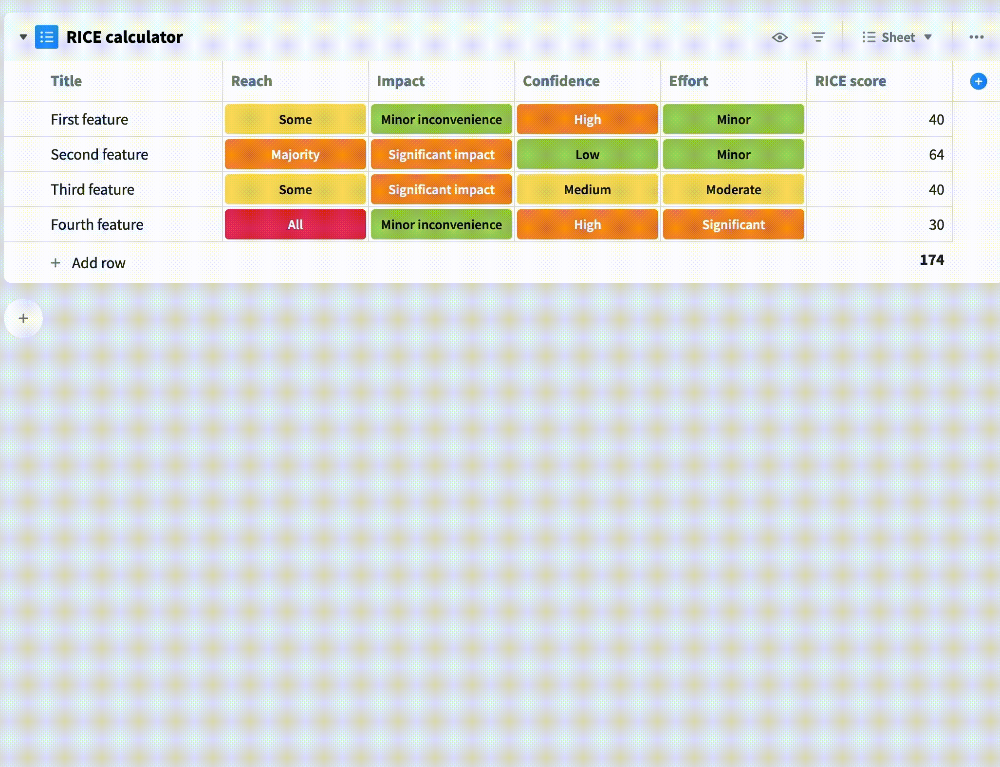
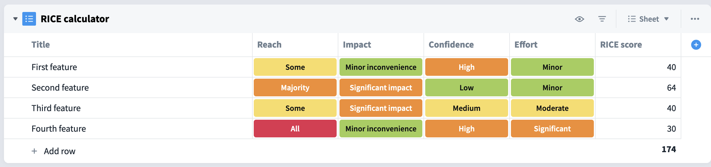
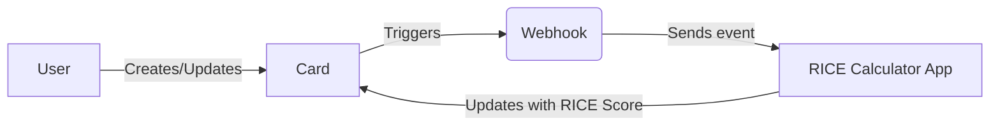
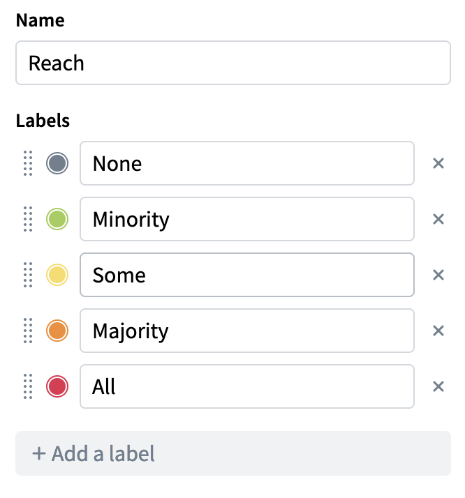
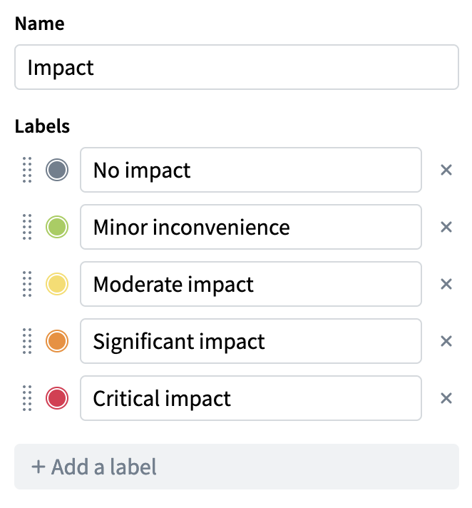
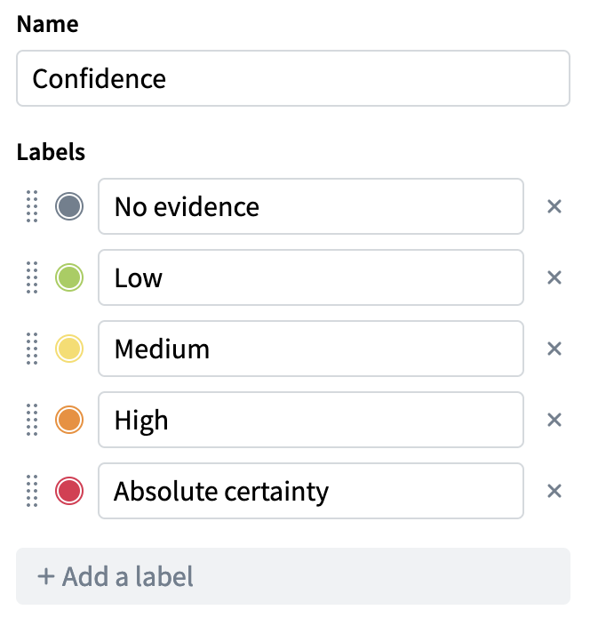
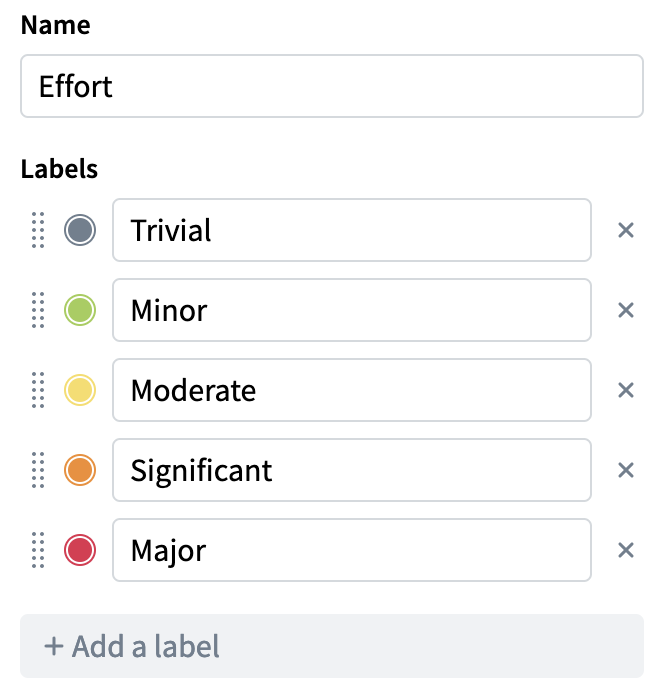
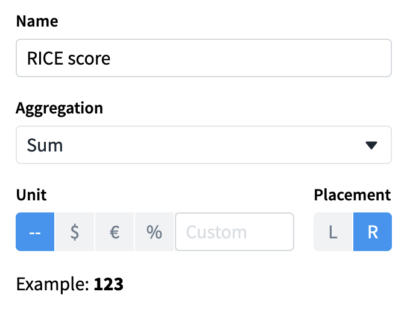
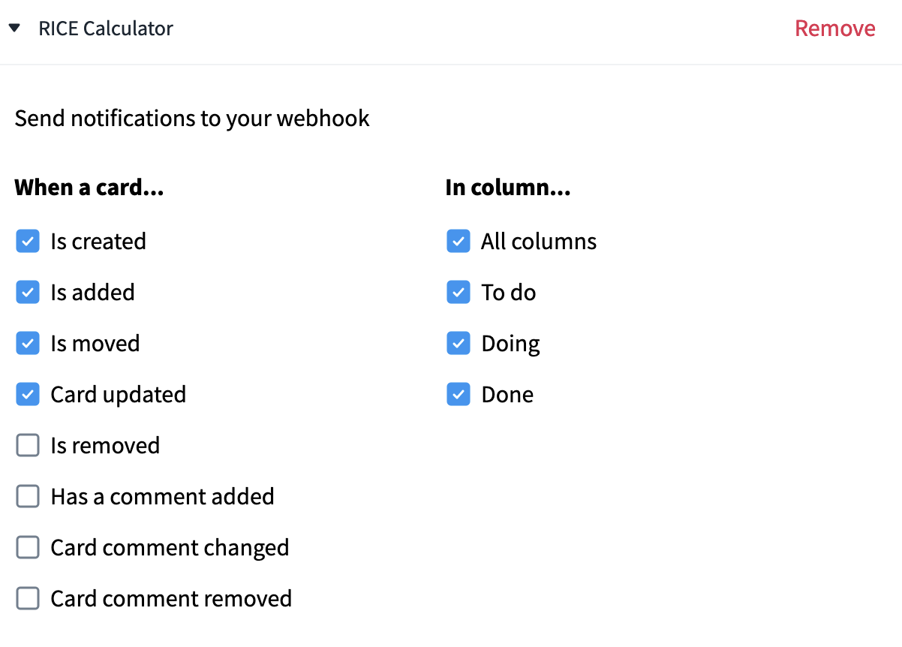
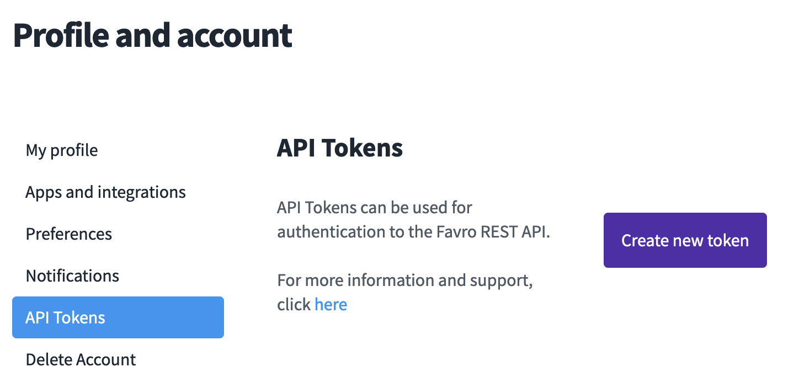

# Outcome



# About the RICE Scoring Model

The RICE model helps prioritize product ideas by scoring them on reach, impact, confidence, and effort. Higher scores mean bigger potential impact with less work, making them better choices.

| Factor | Description |
|---|---|
| **Reach** | Number of users affected by the change |
| **Impact** | Positive impact on users and business |
| **Confidence** | Level of certainty in estimates |
| **Effort** | Time and resources required |

<br/>

```math
\text{RICE Score} = \frac{\text{Reach} \times \text{Impact} \times \text{Confidence}}{\text{Effort}}
```

# Goal

In this example, we will automatically update Favro cards with their **RICE Score** based on the custom fields representing the above Factors (Reach, Impact, Confidence, Effort).



The flow will look like this:


The code in this repository is the **RICE Calculator App** in the above diagram.

## Prerequisites

### Favro board configuration

We will need 4 **Status** custom fields, denoting the 4 factors.






And we will need a **Number** custom field for the **RICE Score**



### Configuring the app

The IDs of the custom fields are going to be unique to your setup. In order to get the relevant custom field IDs, you will need to follow 2 steps:

1. [Get all available custom fields](https://favro.com/developer/#get-all-custom-fields) - note that this list is paginated
1. For each of the relevant custom fields, [get the custom field](https://favro.com/developer/#get-a-custom-field) and extract the ids of items

**Note**: Along with the main application, you will find [a simplified helper](./customfield_helper.js) to help with the above two steps.

Now that you have retrieved all the relevant IDs, update the relevant IDs in the [RICE calculator file](./index.js)
```js
const riceScoreFieldId = "InsertRelevantId"; // RICE Score customfield id

const reachCustomField = {
	customFieldId: "InsertRelevantId", // Reach custom field id
	items: [
		{ id: "InsertRelevantId", value: 1 },  // None
		{ id: "InsertRelevantId", value: 3 },  // Minority
		{ id: "InsertRelevantId", value: 5 },  // Some
		{ id: "InsertRelevantId", value: 8 },  // Majority
		{ id: "InsertRelevantId", value: 10 }, // All
	]
};

const impactCustomField = {
	customFieldId: "InsertRelevantId", // Impact custom field id
	items: [
		{ id: "InsertRelevantId", value: 1 },  // No impact
		{ id: "InsertRelevantId", value: 3 },  // Minor inconvenience
		{ id: "InsertRelevantId", value: 5 },  // Moderate impact
		{ id: "InsertRelevantId", value: 8 },  // Significant impact
		{ id: "InsertRelevantId", value: 10 }, // Critical impact
	]
};

const confidenceCustomField = {
	customFieldId: "InsertRelevantId", // Confidence custom field id
	items: [
		{ id: "InsertRelevantId", value: 1 },  // No evidence
		{ id: "InsertRelevantId", value: 3 },  // Low
		{ id: "InsertRelevantId", value: 5 },  // Medium
		{ id: "InsertRelevantId", value: 8 },  // High
		{ id: "InsertRelevantId", value: 10 }, // Absolute certainty
	]
};

const effortCustomField = {
	customFieldId: "InsertRelevantId", // Efort custom field id
	items: [
		{ id: "InsertRelevantId", value: 1 },  // Trivial
		{ id: "InsertRelevantId", value: 3 },  // Minor
		{ id: "InsertRelevantId", value: 5 },  // Moderate
		{ id: "InsertRelevantId", value: 8 },  // Significant
		{ id: "InsertRelevantId", value: 10 }, // Major
	]
};
```

### Setup webhook on Favro board

Follow our [build your own integrations based on outgoing webhooks](https://help.favro.com/en/articles/1019941-build-your-own-integrations-based-on-outgoing-webhooks) article to setup the following webhook:



**⚠️ Note**: You will need to have an internet accessible address to be able to receive the webhook events

## Running the example

Start by installing the dependencies
```sh
npm install
```

You can either use the recommended environment variables method, or replace the relevant lines in `index.js` with their corresponding values.

`start.sh`:
```sh 
#!/bin/bash
export FAVRO_URL="https://favro.com/api/v1/"
export FAVRO_CALCULATOR_USER="YOUR_EMAIL"
export FAVRO_CALCULATOR_TOKEN="YOUR_TOKEN"
export FAVRO_ORG_ID="YOUR_ORGANIZATION_ID"
export FAVRO_WEBHOOK_URL="http://127.0.0.1:5000"
export FAVRO_WEBHOOK_SECRET_KEY="YOUR_WEBHOOK_SECRET"

node index.js
```

**Note**: We recommend using an API Token instead of your password. You can generate the token in your profile in Favro



Then make sure it's runnable with:
```sh
chmod +x start.sh
```

Finally, run the script
```sh
./start.sh
```